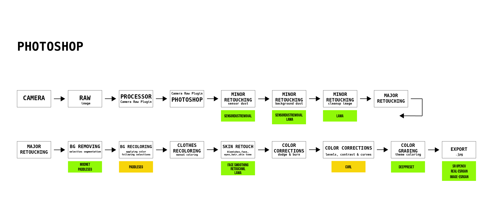

# visualising the imperceptible

Project page for research project Visualising The Imperceptible (Lieven Verkens)

## Introduction

### Research questions

1. To what extent can we use open source machine learning models to remove repetitive and labor intensive work from a photographer?
2. To what extent does the workfield think or hope that AI/ML would change their future craft?
3. How is it possible to combine open source machine learning models within the current workflow of photographers?

4. Additionally: Can AI be of value as a creative stimuli in the creation of a notebook?

## comparison with SOTA

|metric|our solution|lightroom|photoshop|luminar|capture one|
|---|---|---|---|---|---|
|batchmode| auto | 1/2 auto* | 1/2 auto* | manual | manual |
|sensor dust| auto | 1/2 auto* | manual | manual |
|background dust||||||
|image cleanup|x with manual|||||
|background removal| auto | manual | manual | manual | manual |
|background replacement| auto | manual | manual | manual | manual |
|clothes recoloring |-|||||
|skin correction| auto | manual | manual | manual | manual |
|color correction: dodge & burn|-| manual | manual | manual | manual |
|color corrections: levels,contrast & curves | auto | 1/2 auto* | 1/2 auto* | 1/2 auto* | 1/2 auto* |
|color grading| auto | 1/2 auto* | 1/2 auto* | 1/2 auto* | 1/2 auto* |
|image upscaling| auto || 1/2 auto* |||
|||||||

* manual preset

## Metrics

| target     | resolution px | other metrics (e.g. | DPI |  
| ---------- | ------------- | ------------------- | --- |
| smartphone | ≥ 750x1334    |                     | 326 |
| smartphone | ≤ 1440x3120   |                     | 564 |
| laptop     | ≥ 1080x1920   |                     | 72  |
| laptop     | ≤ 3000x2000   |                     | 72  |
| lookbook 1 | 816x1056      | 215.9x279.4 mm (A4) | 96  |
| lookbook 2 | 528x816       | 139.7x215.9 mm (A5) | 96  |
| lookbook 1 | 2550x3300     | 215.9x279.4 mm (A4) | 300 |
| lookbook 2 | 1650x2550     | 139.7x215.9 mm (A5) | 300 |
| IG-post SQ | 1080x1080     |                     | 72  |
| IG-post H  | 1200x608      |                     | 72  |
| IG-post V  | 1080x1350     |                     | 72  |
| IG-story   | 1080x1920     |                     | 72  |

## folder structure

In notebooks, per topic there's a directory with notebooks to evaluate different approaches. In the accompanying markdown file we note down the expected result and findings.
